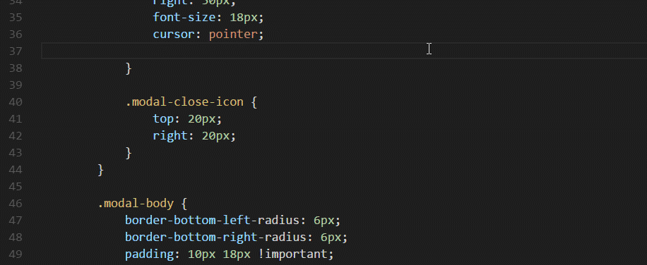

# VS Color Picker
A tiny & smart color picker for web developer. 

You can pick a color from system palette: 

Or pick a color from screen. 
Move cursor to the pixel and press `Enter` to pick, `Esc` to cancel:

## Usage
There are three ways to launch color picker:

1. After typing the character `#` or moving the caret after character `#`, the picker will be launched automatically.
2. Execute command `VS Color Picker` in Command Palette(`Ctrl + Shift + P` or `Cmd + Shift + P`).
3. [Binding a key](https://code.visualstudio.com/docs/customization/keybindings) for command `extension.vs-color-picker`.

## Setting Options
This extension contributes the following variables to the [settings](https://code.visualstudio.com/docs/customization/userandworkspace):
* `vs-color-picker.autoLaunch`: When `true`, the picker will be launched automatically. To disable auto-launch, set this option as `false`. Default value is `true`.
* `vs-color-picker.autoLaunchDelay`: Milliseconds before launching. When further typing color number during this span, the picker won't be launched. Default value is `100`.